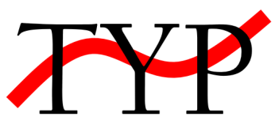

Typ is a simple typesetting application. Turn plain Markdown into a formatted PDF ready for print.

Focus on content, not formatting.

## Features

- Create entire books in [Markdown](https://www.markdownguide.org/)
- Simple command line interface
- Easily configure page dimensions, fonts, formatting, and so on
- Produce PDFs usable by print on demand services
- Cross platform (Soon...)

## Get started

New to Typ? See [Getting Started](./getting-started.md).

## Download and install

If you're already familiar with Typ, you can download and install it from the [Installation](./usage/installation.md) page.

## Comments? Questions?

Typ is still in an early stage of development. Be sure to keep checking this page for the latest news.

You can view the entire source code for this site on it's [GitHub page](https://github.com/MikielAgutu/typ-site). Feel free to open a Pull Request to make your own contribution. Alternatively, if you have any feature requests or bug reports, then open an issue.