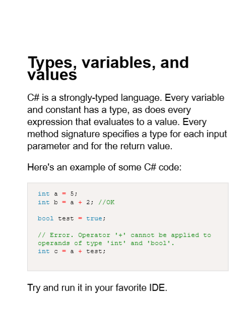

Typ is a simple typesetting application. Turn plain Markdown into a formatted PDF, ready for print.

Focus on content, not formatting.

## Features

- [Markdown](usage/writing-markdown.md) to PDF conversion
- Command line interface
- Syntax highlighting
- Configure page dimensions, fonts, formatting, and so on
- Produce PDFs usable by print on demand services
- Windows and Linux support

## Example

Running the following command:

`typ typset`

Against this markdown:

```c#
int a = 5;
int b = a + 2; //OK

bool test = true;

// Error. Operator '+' cannot be applied to operands of type 'int' and 'bool'.
int c = a + test;
```

Produces this PDF:



See [the sample project](https://github.com/MikielAgutu/typ-site/tree/master/sample-project) for the full PDF file.

## Get started

See [Getting Started](./getting-started.md).

## Download and install

See the [Installation](./usage/installation.md) page.

## Comments? Questions?

Typ is still in an early stage of development. For the latest news, follow Typ on Twitter [@typ_set](https://twitter.com/typ_set).

You can view the entire source code for this site on it's [GitHub page](https://github.com/MikielAgutu/typ-site). If you have a bug report, feature request, or question, feel free to open a GitHub issue. Pull Requests are also welcome if you'd like to contribute your own changes.